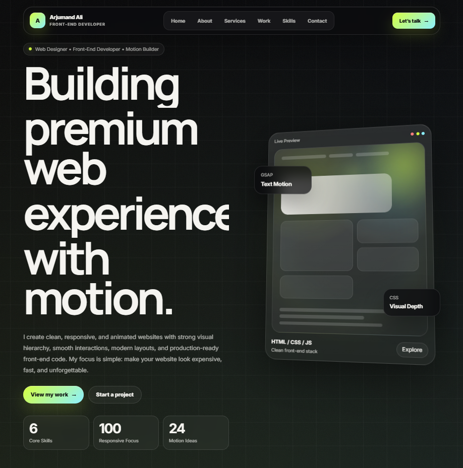

<div align="center">

# 🚀 Arjumand Ali Portfolio

### Modern WordPress & Front-End Developer Portfolio

<p>
A clean, responsive, and modern personal portfolio website built to showcase my work,
skills, services, projects, and developer brand.
</p>

<br>

<a href="https://arjumandali-xp.vercel.app/" target="_blank">
  
</a>

<br><br>


</div>

---

# ✨ Overview

This project is my personal developer portfolio website.

The portfolio was designed and developed to present my:

- Front-end development skills
- WordPress & Elementor work
- UI design style
- Responsive layouts
- Personal branding
- Modern web experiences
- Website projects and services
- Contact details and social profiles

The website focuses on clean typography, responsive design, smooth layout structure,
modern visuals, strong calls to action, and professional presentation.

---

# 🌐 Live Website

### 🔗 Portfolio Link

👉 **[https://arjumandali-xp.vercel.app/](https://arjumandali-xp.vercel.app/)**

---

# 📌 Project Status

✅ Live on Vercel  
✅ Indexed on Google  
✅ SEO optimized  
✅ Responsive layout completed  
✅ Social profiles connected  
✅ Sitemap and robots.txt added  
✅ FAQ schema added  

---

# 🧠 Tech Stack

<div align="center">


</div>

---

# 🎯 Features

✅ Responsive design for all devices  
✅ Modern dark UI  
✅ Smooth interactions and animations  
✅ Optimized portfolio layout  
✅ SEO-friendly structure  
✅ Social profile integration  
✅ Fast deployment using Vercel  
✅ Custom sections and clean spacing  
✅ Mobile-friendly navigation  
✅ FAQ schema and metadata optimization  
✅ Google Search Console verification  
✅ Sitemap and robots.txt setup  
✅ Contact form integration  
✅ Professional project showcase  

---

# 📸 Portfolio Preview

<div align="center">



</div>

---

# 📂 Project Structure

```bash
arjumandali-xp/
│
├── assets/
│   ├── Images/
│   └── Resume/
│
├── index.html
├── style.css
├── script.js
├── sitemap.xml
├── robots.txt
└── README.md
```

---

# 🚀 Installation

Clone the repository:

```bash
git clone https://github.com/arjumand-codes/arjumandali-xp.git
```

Open the project folder:

```bash
cd arjumandali-xp
```

Run locally with Live Server or open:

```bash
index.html
```

---

# 💼 Services Highlighted

- WordPress Development
- Elementor Websites
- Front-End Development
- Landing Page Design
- Website Redesign
- Responsive Layout Fixes
- UI Improvements
- Portfolio Websites
- Business Websites
- Website Speed Optimization
- Basic SEO Structure

---

# 📱 Responsive Design

The portfolio is optimized for:

| Device | Support |
|---|---|
| Mobile | ✅ |
| Tablet | ✅ |
| Laptop | ✅ |
| Desktop | ✅ |

---

# 🔍 SEO Improvements

This project includes:

- Meta title
- Meta description
- Open Graph tags
- Twitter card tags
- Canonical URL
- Sitemap.xml
- Robots.txt
- FAQ schema
- ProfilePage schema
- Structured data
- Google site verification
- Social profile linking
- Search engine friendly content

---

# ⚡ Performance Focus

The project is designed with performance in mind:

- Clean HTML structure
- Organized CSS
- Optimized layout sections
- Lightweight static deployment
- Vercel hosting
- Image optimization workflow
- Mobile-first improvements

---

# 🔗 Official Profiles

This portfolio connects my official online presence:

| Platform | Link |
|---|---|
| Portfolio | [arjumandali-xp.vercel.app](https://arjumandali-xp.vercel.app/) |
| GitHub | [github.com/arjumand-codes](https://github.com/arjumand-codes) |
| LinkedIn | [linkedin.com/in/arjumand-ali](https://www.linkedin.com/in/arjumand-ali/) |
| Instagram | [instagram.com/arjumand.codes](https://www.instagram.com/arjumand.codes/) |

---

# 📬 Connect With Me

<div align="center">

<a href="https://arjumandali-xp.vercel.app/" target="_blank">
  
</a>

<a href="https://www.linkedin.com/in/arjumand-ali/" target="_blank">
  
</a>

<a href="https://github.com/arjumand-codes" target="_blank">
  
</a>

<a href="https://www.instagram.com/arjumand.codes/" target="_blank">
  
</a>

<a href="mailto:arjumandali974@gmail.com">
  
</a>

</div>

---

# 👨‍💻 Developer

## Arjumand Ali

WordPress & Front-End Developer focused on creating responsive websites,
modern UI layouts, Elementor websites, landing pages, portfolio websites,
website redesigns, and clean web experiences.

---

# 🔐 Usage Notice

This repository is public for portfolio viewing, demonstration, and review purposes only.

You are not allowed to copy, reuse, modify, distribute, sell, or publish this project,
its design, source code, layout, branding, text, images, or assets without written permission.

If you want to use any part of this project, contact me first.

---

# 📄 License

© 2026 Arjumand Ali. All Rights Reserved.

This project and all of its contents are the property of Arjumand Ali.

Unauthorized copying, modification, distribution, reuse, or commercial use of this project
or any part of it is strictly prohibited.

For permission requests, contact:

**Email:** arjumandali974@gmail.com  
**Portfolio:** [https://arjumandali-xp.vercel.app/](https://arjumandali-xp.vercel.app/)  
**GitHub:** [https://github.com/arjumand-codes](https://github.com/arjumand-codes)

---

# 🧩 Keywords

```txt
Arjumand Ali
Arjumand Ali Portfolio
Arjumand Ali WordPress Developer
Arjumand Ali Front-End Developer
arjumand-codes
WordPress Developer Pakistan
Elementor Developer
Front-End Developer
HTML CSS JavaScript
Tailwind CSS Developer
Responsive Website Developer
Portfolio Website Developer
Website Designer Pakistan
WordPress Portfolio Website
Modern Developer Portfolio
```

---

# ⭐ Support

If you like this project, consider giving it a ⭐ on GitHub.

---

<div align="center">

### 🚀 Built with passion by Arjumand Ali

**Clean design. Responsive layout. Professional web experience.**

<a href="https://arjumandali-xp.vercel.app/" target="_blank">
  
</a>

</div>
